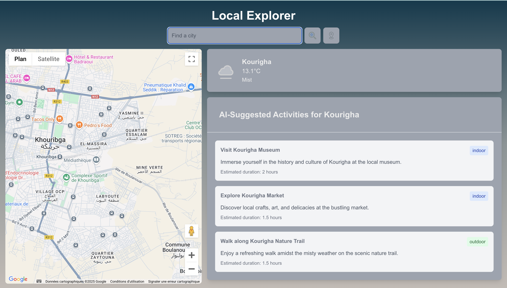

# SpotSpotter
Local Explorer app 
=======
Local Explorer Project
This project is a web application that allows users to explore local activities based on their current location, weather conditions, and the time of day. It leverages APIs for weather data, OpenAI, and Google Maps, and uses Prisma to interact with a PostgreSQL database.

Features
Current Location Detection: Uses the browser's geolocation API to get the user's current location.
Weather Data: Retrieves current weather information based on the user's location.
Activity Suggestions: Suggests activities based on the weather, time of day, and available categories (e.g., outdoor, cultural).
Interactive Map: Displays a map with markers for local activities using Google Maps.
Prerequisites
Node.js (v14 or higher)
PostgreSQL (for database)
Prisma (for database management)
## Installation & Setup

```
git clone [your-repository-url]
cd [repository-name]
```

## SSL Setup
1. Create SSL directory:
   mkdir -p nginx/ssl

2. Generate development certificates:
   openssl req -x509 -nodes -days 365 -newkey rsa:2048 \
   -keyout nginx/ssl/key.pem \
   -out nginx/ssl/cert.pem

## Environment Variables
Create a .env file in the root directory and add the following required environment variables:
```
NEXT_PUBLIC_OPENAI_API_KEY=your_openai_api_key
NEXT_PUBLIC_GOOGLE_MAPS_API_KEY=your_google_maps_api_key
NEXT_PUBLIC_WEATHER_API_KEY=your_weather_api_key
NEXT_PUBLIC_OPENWEATHER_API_KEY=your_openweather_api_key
NODE_ENV=development
```
You'll need to obtain these API keys from:

OpenAI Platform
Google Cloud Console
OpenWeather

## Build and start the containers

```
docker-compose up -d --build
```
To stop the containers:

```
docker-compose down
```
The application will be available at:

HTTPS: https://localhost:443

## App screen 


## Contact
If you encounter any issues please contact me on asseraouhanane@gmail.com


>>>>>>> 
